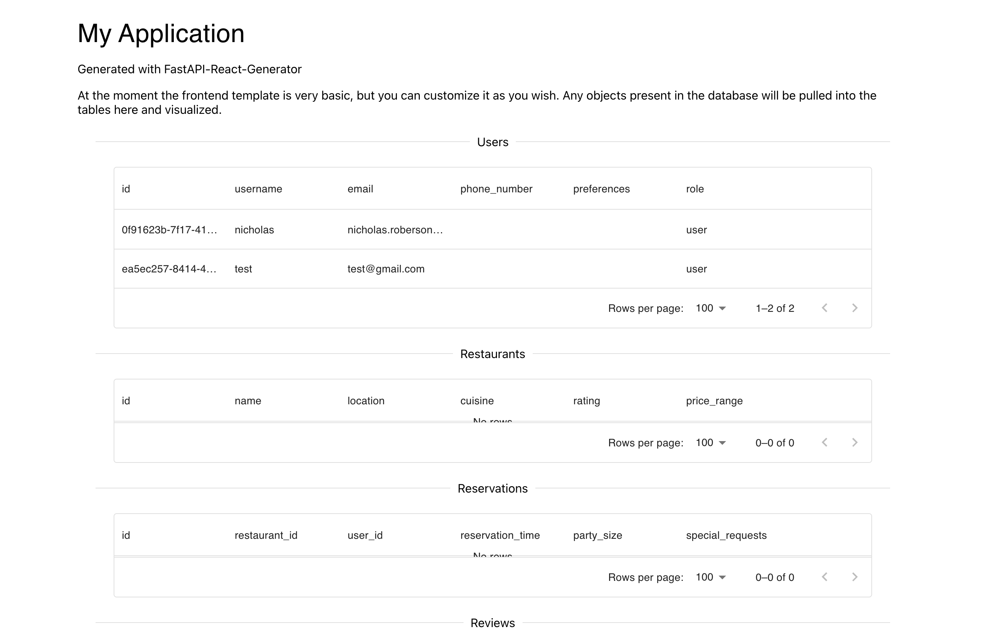

<h1 align="center"> A CLI for FastAPI + React Service Generation </h1>

<p align="center" markdown=1>
    <i>
        Generate POC FastAPI services with React frontends using a simple CLI tool.
        Database generation is supported for MongoDB.
    </i>
</p>

<h3 align="center">Backend</h3>

<p align="center">
    <a href="">
        
    </a>
    <a href="https://fastapi.tiangolo.com"> 
    </a>
    <a href="https://docs.pydantic.dev/2.4/">
        
    </a>
    <a href="https://www.mongodb.com/">
        
    </a>
    <a href="https://www.docker.com/">
        
    </a>
</p>

<h3 align="center">Frontend</h3>

<p align="center">
    <a href="https://www.typescriptlang.org/">
        
    </a>
    <a href="https://reactjs.org/">
        
    </a>
</p>


<h3 align="center">Future Additions</h3>
<p align="center">
    <a href="https://docs.celeryq.dev/en/stable/">
        
    </a>
    <a href="https://redis.com/">
      
    </a>
    <a href="https://www.mysql.com/">
      
    </a>
</p>


This is a simple FastAPI service that can be used as a starting point for a new project.

## Features

#### Python Code Generation
- Generate FastAPI services with `MongoDB` database support (via model managers)
- Generate `pydantic` models for the FastAPI services
- Generate Python client code for the FastAPI service using `openapi-generator`

#### Frontend Code Generation
- Generate a React frontend with TypeScript
- Generate TypeScript and Python clients for the FastAPI service using `openapi-generator`
- Generate homepage to display all the models that have been generated

#### Linting
- Lint the frontend code using `prettier`, `esLint`
- Lint the backend code using `black`, and `isort`

#### Docker
- Generate Dockerfiles for the FastAPI service and the React frontend

## Installation

- Poetry installed
- Python 3.12.2 installed (can install via poetry)
- MongoDB Atlas database and the `MONGO_URI` environment variable set

To learn more about how to set up a free tier MongoDB Atlas database,
see the following link: [MongoDB Atlas](https://www.mongodb.com/cloud/atlas)
- Click "Try Free" and follow the instructions to set up a free tier database

## Setup

This project runs using poetry and should have all the basic imports declared in the `pyproject.toml` file.
```bash
% poetry install
```

## Usage

Define a YAML file anywhere that you would like to, it only has to match the format of the example below.

This is the CLI interface for the service generator:
```bash
 Usage: main.py [OPTIONS] COMMAND [ARGS]...

╭─ Options ───────────────────────────────────────────────────────────────────────────────────────────────────────────────────────────────────────────────────────────────────────────────────────────────╮
│ --install-completion        [bash|zsh|fish|powershell|pwsh]  Install completion for the specified shell. [default: None]                                                                                │
│ --show-completion           [bash|zsh|fish|powershell|pwsh]  Show completion for the specified shell, to copy it or customize the installation. [default: None]                                         │
│ --help                                                       Show this message and exit.                                                                                                                │
╰─────────────────────────────────────────────────────────────────────────────────────────────────────────────────────────────────────────────────────────────────────────────────────────────────────────╯
╭─ Commands ──────────────────────────────────────────────────────────────────────────────────────────────────────────────────────────────────────────────────────────────────────────────────────────────╮
│ generate-app                                      Generate a FastAPI backend and React frontend from the input yaml config.                                                                             │
│ generate-python-app                               Generate a FastAPI backend from the input yaml config.                                                                                                │
│ generate-typescript-app                           Generate a React frontend from the input yaml config.                                                                                                 │
│ revert                                            Revert the service to a previous version.                                                                                                             │
│ versions                                          List all versions of the service that have been generated.                                                                                            │
╰─────────────────────────────────────────────────────────────────────────────────────────────────────────────────────────────────────────────────────────────────────────────────────────────────────────╯
```

For an example of a config that you can use to generate a service, see the `example/configs/user_groups.yaml` file.
You can also declare your own config file, but it must match the format of the example.

I plan on adding a more interactive way to generate the config file in the future, via some command line prompts such as `build-config`, but that is yet to come.


Here is an example of the output that you will see when you run the service generator:
```bash
% VERBOSE=0 && poetry run python main.py generate-app \
    --config example/configs/restaurant_reservations.yaml \
    --output-dir example/output

Generating Frontend and Backend services for app `reservations-app`
        config:     example/configs/restaurant_reservations.yaml
        output_dir: example/output


Generating backend and frontend services...

        1. Clearing the output directory...
        2. Generating the backend code...
        3. Generating the non-code files (poetry and readme)...
        4. Exporting OpenAPI JSON file...
        5. Generating the python client code...
                > 'openapi-generator generate -i openapi.json -g python -o /Users/nicholas/Code/fastapi-gen/example/output/client'
        6. Installing the backend dependencies...
                > 'poetry env use 3.12.2'
                > 'poetry install'
                > 'poetry export -f requirements.txt --output requirements.txt'
        7. Linting the backend code...
                > 'poetry run black /Users/nicholas/Code/fastapi-gen/example/output/src'
                > 'poetry run isort /Users/nicholas/Code/fastapi-gen/example/output/src'

Generating frontend services...

        1. Clearing generated frontend code...
        2. Generating frontend code ...
                > 'npx create-react-app reservations-app --template typescript'
        3. Installing dependencies...
                > 'npm install axios @mui/material @mui/icons-material @mui/x-data-grid @mui/styled-engine @mui/lab @emotion/react @emotion/styled prettier eslint web-vitals'
        4. Generating App main page...
        5. Generating Typescript client...
                > 'openapi-generator generate -i /Users/nicholas/Code/fastapi-gen/example/output/src/openapi.json -g typescript-fetch -o
/Users/nicholas/Code/fastapi-gen/example/output/reservations-app/src/api'
        6. Linting frontend code...
                > 'npx prettier --write .'
                > 'npx eslint --fix .'

Generated files:
        Backend Files:
                Pydantic Models: ['/Users/nicholas/Code/fastapi-gen/example/output/src/models/models.py']
                FastAPI Service: ['/Users/nicholas/Code/fastapi-gen/example/output/src/service.py']
                Model Managers: ['/Users/nicholas/Code/fastapi-gen/example/output/src/user_manager.py', '/Users/nicholas/Code/fastapi-gen/example/output/src/restaurant_manager.py',
'/Users/nicholas/Code/fastapi-gen/example/output/src/reservation_manager.py', '/Users/nicholas/Code/fastapi-gen/example/output/src/review_manager.py']
                MongoDB: ['/Users/nicholas/Code/fastapi-gen/example/output/src/mongo.py']
                README.md: ['/Users/nicholas/Code/fastapi-gen/example/output/src/README.md']
                Poetry: ['/Users/nicholas/Code/fastapi-gen/example/output/src/pyproject.toml']
        Backend Directories:
                Service Code: /Users/nicholas/Code/fastapi-gen/example/output/src
                Python Client Code: /Users/nicholas/Code/fastapi-gen/example/output/client
        Frontend Files:
                Main Page: /Users/nicholas/Code/fastapi-gen/example/output/reservations-app/src/App.tsx
        Frontend Directories:
                Application Directory: /Users/nicholas/Code/fastapi-gen/example/output/reservations-app
                Source Code: /Users/nicholas/Code/fastapi-gen/example/output/reservations-app/src
                API Client Code: /Users/nicholas/Code/fastapi-gen/example/output/reservations-app/src/api

Run the following commands to run the service:
        % cd /Users/nicholas/Code/fastapi-gen/example/output/src
        % poetry run uvicorn service:app --reload --port 8000

Run the following commands to run the frontend:
        % cd /Users/nicholas/Code/fastapi-gen/example/output/reservations-app
        % npm start

```

## Running

### Back End

Two options, you can either run from your local environment or from the docker container.

Local:
```
% cd /Users/nicholas/Code/fastapi-gen/output
% poetry run uvicorn service:app --reload --port 8000
```

Docker:
```
% cd /Users/nicholas/Code/fastapi-gen/output
% docker build -t myfastapiapp .
% docker run -p 8000:8000 myfastapiapp
```

To view the generated OpenAPI documentation, navigate to [http://localhost:8000/docs](http://localhost:8000/docs).

### Front End
```
% cd /Users/nicholas/Code/fastapi-gen/example-output/nicksapp
% npm start
```

Once you have run the above command, you can navigate to [http://localhost:3000](http://localhost:3000) to view the generated React application. And it should look something like this:
<p align="center">
  
</p>

## Import Config to Postman

You can import the API into Postman by following the steps in the following link: [Importing a Collection Using OpenAPI](https://learning.postman.com/docs/integrations/available-integrations/working-with-openAPI/)

The OpenAPI documentation can be found at [http://localhost:8000/docs](http://localhost:8000/docs). The raw JSON
for the OpenAPI documentation can be found at [http://localhost:8000/openapi.json](http://localhost:8000/openapi.json).
