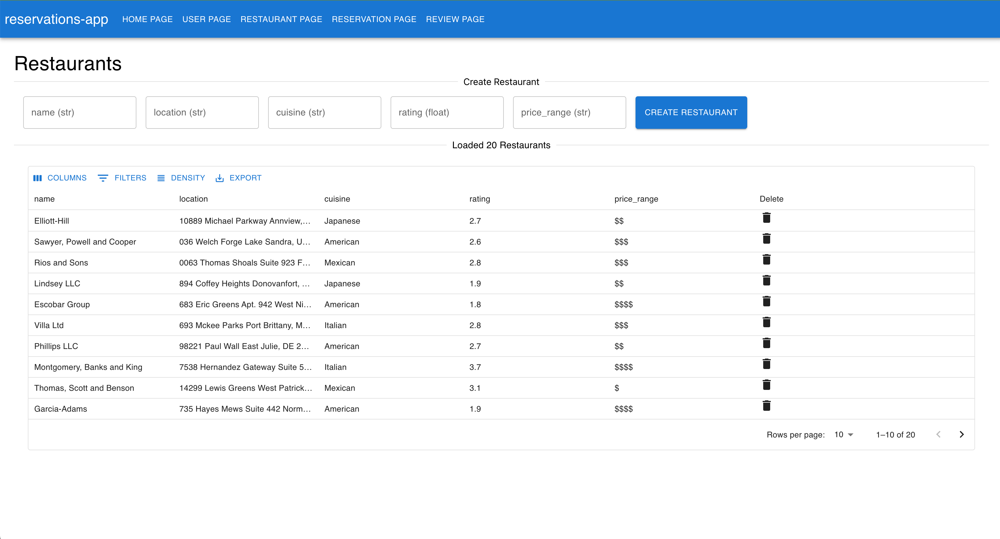
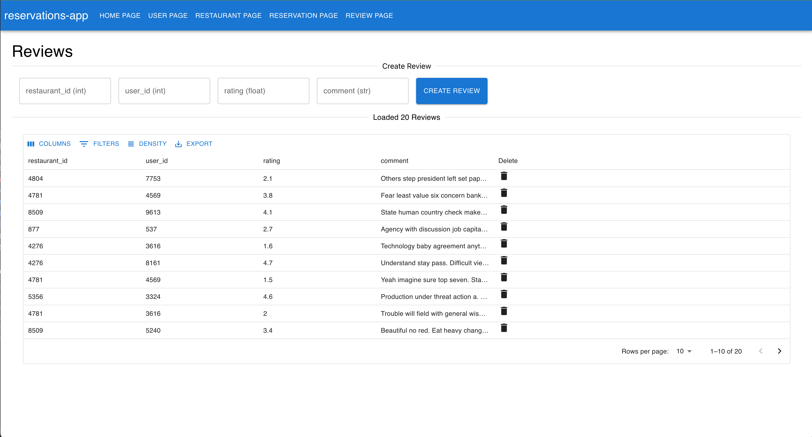

<h1 align="center"> A CLI for FastAPI + React Service Generation </h1>

<p align="center" markdown=1>
    <i>
        Generate POC FastAPI services with React frontends using a simple CLI tool.
        Database generation is supported for MongoDB, PostgreSQL, and MySQL.
    </i>
</p>

<h3 align="center">Backend</h3>
<p align="center">
    <a href="">
        
    </a>
    <a href="https://fastapi.tiangolo.com"> 
    </a>
    <a href="https://docs.pydantic.dev/2.4/">
        
    </a>
    <a href="https://www.docker.com/">
        
    </a>
</p>

<h3 align="center">Database </h3>
<p align="center">
    <a href="https://www.mongodb.com/">
        
    </a>
    <a href="https://www.sqlalchemy.org/">
        
    </a>
    <a href="https://www.postgresql.org/">
        
    </a>
    <a href="https://www.mysql.com/">
        
    </a>

<h3 align="center">Frontend</h3>

<p align="center">
    <a href="https://www.typescriptlang.org/">
        
    </a>
    <a href="https://reactjs.org/">
        
    </a>
</p>


<h3 align="center">Future Additions</h3>
<p align="center">
    <a href="https://docs.celeryq.dev/en/stable/">
        
    </a>
    <a href="https://redis.com/">
      
    </a>
</p>

**NOTE:** This project is still in active development and is not yet intended for production use. However, it does work well for general cases as well as for POCs.

# Table of Contents

- [Features](#features)
  - [Python Code Generation](#python-code-generation)
  - [Database Generation](#database-generation)
  - [Frontend Code Generation](#frontend-code-generation)
- [Images](#images)
- [Setup](#setup)
- [Usage](#usage)
- [Example](#example)
- [Running](#running)
  - [Back End](#back-end)
  - [Front End](#front-end)
  - [Regenerating Templated Files](#regenerating-templated-files)
- [Test Data](#test-data)


This is a simple FastAPI service that can be used as a starting point for a new project.

## Features

####  Python Code Generation
1. Generate FastAPI services with `MongoDB` database support (via model managers)
2. Generate `pydantic` models for the FastAPI services
3. Generate Python client code for the FastAPI service using `openapi-generator`


#### Database Generation

1. Generate a `MongoDB` database with `Pydantic` models
2. Generate a `PostgreSQL` database with `SQLAlchemy` models
3. Generate a `MySQL` database with `SQLAlchemy` models

#### Frontend Code Generation

1. Generate a React frontend with TypeScript
   - Create a homepage that displays all the models that have been generated
   - Create a page for each model that allows you to interact with the FastAPI service
2. Generate TypeScript and Python clients for the FastAPI service using `openapi-generator`

## Images

<div style="padding: 50px;">
  
</div>

Here is an example of the homepage that is generated for the React frontend. It will display all the models that have been generated.

<div style="padding: 100px;">
  
  
  
  
</div>

All models will have a page similar to the one above, where you can interact with the FastAPI service.

## Setup

**General**
- Poetry installed
- Python 3.12.2 installed (can install via poetry)
-
**Database**
- If using **MongoDB** as the database, you will need to set up a free tier MongoDB Atlas database as well as have `MONGO_URI` set in your environment variables.
- If using **PostgreSQL** or **MySQL** as the database, you will need to set up either database locally or somewhere else and have the following environment variables set:
  - `DB_USER`
  - `DB_PASSWORD`
  - `DB_HOST`
  - `DB_PORT`
  - `DB_NAME`
- The options in the config for the `db_type` are `mongo`, `postgres`, and `mysql`

To learn more about how to set up a free tier MongoDB Atlas database,
see the following link: [MongoDB Atlas](https://www.mongodb.com/cloud/atlas)
- Click "Try Free" and follow the instructions to set up a free tier database

**Poetry**

All you should need to do before running otherwise is to install the dependencies using poetry.
```bash
% poetry install
```

## Example

You can find an example config for both `MongoDB` and `MySQL + Alembic` in the `example/` directory
under their respective folders.

In addition, there is a full generated example of a `Restaurant` service in the `example/alembic/output` directory.
You should be able to run the service and frontend by following the instructions below so long as you have all the
correct environment variables set (see the `setup` section for more information).

## Usage

This is the CLI interface for the service generator:
```bash
% poetry run python main.py --help

 Usage: main.py [OPTIONS] COMMAND [ARGS]...

╭─ Options ───────────────────────────────────────────────────────────────────────────────────────────────────────────────────────────────────────────────────────────────────────────────────────────────╮
│ --install-completion        [bash|zsh|fish|powershell|pwsh]  Install completion for the specified shell. [default: None]                                                                                │
│ --show-completion           [bash|zsh|fish|powershell|pwsh]  Show completion for the specified shell, to copy it or customize the installation. [default: None]                                         │
│ --help                                                       Show this message and exit.                                                                                                                │
╰─────────────────────────────────────────────────────────────────────────────────────────────────────────────────────────────────────────────────────────────────────────────────────────────────────────╯
╭─ Commands ──────────────────────────────────────────────────────────────────────────────────────────────────────────────────────────────────────────────────────────────────────────────────────────────────────────────────────╮
│ generate-app                                        Generate a FastAPI backend and React frontend from the input yaml config.                                                                                                   │
│ generate-python-app                                 Generate a FastAPI backend from the input yaml config.                                                                                                                      │
│ generate-typescript-app                             Generate a React frontend from the input yaml config.                                                                                                                       │
│ regenerate-templates                                Just regenerate the frontend or backend templates, do not recreate the application                                                                                          │
╰─────────────────────────────────────────────────────────────────────────────────────────────────────────────────────────────────────────────────────────────────────────────────────────────────────────────────────────────────╯
```

You can find an example config file in the `example/` directory. There should be one for `MongoDB` and one for `MySQL + Alembic`.
This setup should also work for Postgres, but I have not tested it yet.

### Generate using Alembic

Once you have your config ready (or you can use the example config), you can generate the service using the following command:
```bash
% poetry run python main.py generate-app \
    --config example/alembic/restaurant.yaml \
    --output-dir example/alembic/output

...

Run the following commands to run the service:
        % example/alembic/output/backend
        % poetry install && poetry update
        % poetry run uvicorn service:app --reload --port 8000

Run the following commands to run the frontend:
        % cd example/alembic/output/reservations-app
        % npm install
        % npm start
```

### Generate using Mongo

```bash
% poetry run python main.py generate-app \
    --config example/mongo/restaurant.yaml \
    --output-dir example/mongo/output

...

Run the following commands to run the service:
    % cd example/alembic/output/backend
    % poetry install && poetry update
    % poetry install && poetry run uvicorn service:app --reload --port 8000

Run the following commands to run the frontend:
    % cd example/alembic/output/reservations-app
    % npm install
    % npm start
```

## Running

### Back End

**Local:**
```
% cd example/alembic/output/backend
% poetry install && poetry update
% poetry install && poetry run uvicorn service:app --reload --port 8000
```

**Docker:**

```
% cd example/alembic/output/backend
% docker build -t myfastapiapp .
% docker run -p 8000:8000 myfastapiapp
```

To view the generated OpenAPI documentation, navigate to [http://localhost:8000/docs](http://localhost:8000/docs).

### Front End

```
% cd example/alembic/output/reservations-app
% npm install
% npm start
```

### Regenerating Templated Files

If you want to regenerate the templates for the frontend or backend, you can use the `regenerate-templates` command.

```bash
% poetry run python main.py regenerate-templates frontend \
    --config example/alembic/restaurant.yaml \
    --output-dir example/alembic/output

...

Regenerated frontend templates!
```

If you want to regenerate the backend templates, you can use the following command:

```bash
% poetry run python main.py regenerate-templates backend \
    --config example/alembic/restaurant.yaml \
    --output-dir example/alembic/output

...

Regenerated backend templates!
```

## Test Data

Right now I am working on a script that will generate test data for the FastAPI service, but it is not yet complete.

There is a script that works for the example in the `builder/scripts/create_restaurant_app_data.py` file.
You can use a method similar to that in order to create and insert fake data.

Once that is done you can just copy the contents of the files into postman and submit them
to the create many endpoints of the FastAPI service.
