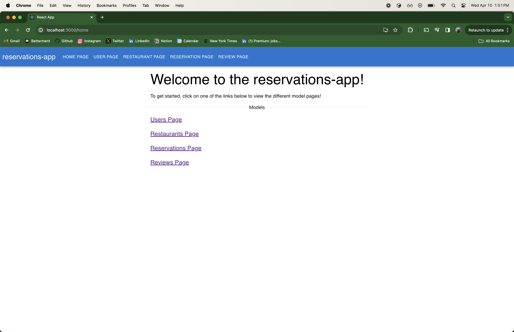
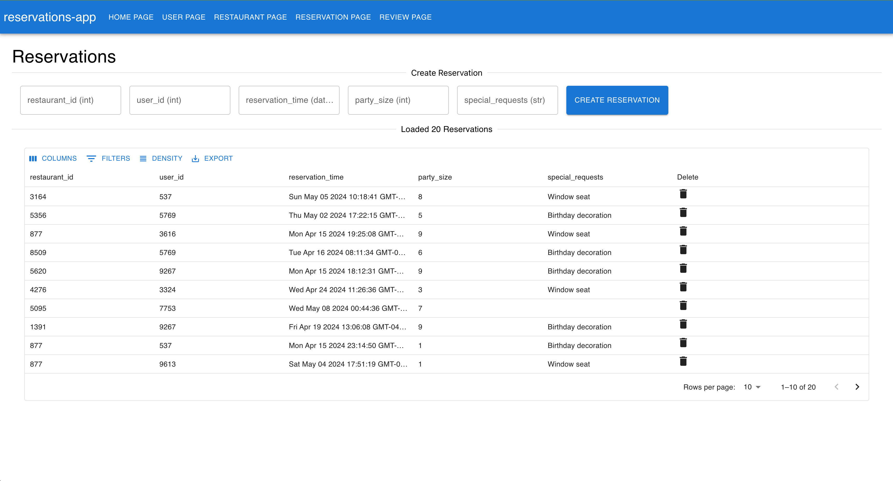

<h1 align="center"> A CLI for FastAPI + React Service Generation </h1>

<p align="center" markdown=1>
    <i>
        Create proof-of-concept FastAPI services with React frontends effortlessly using a simple CLI tool. 
        Database support includes MongoDB, PostgreSQL, and MySQL.
        ... Collaborators are always welcome!
    </i>
</p>

<h3 align="center">Backend</h3>
<p align="center">
    <a href="">
        
    </a>
    <a href="https://fastapi.tiangolo.com"> 
    </a>
    <a href="https://docs.pydantic.dev/2.4/">
        
    </a>
    <a href="https://www.docker.com/">
        
    </a>
</p>

<h3 align="center">Database </h3>
<p align="center">
    <a href="https://www.mongodb.com/">
        
    </a>
    <a href="https://www.sqlalchemy.org/">
        
    </a>
    <a href="https://www.postgresql.org/">
        
    </a>
    <a href="https://www.mysql.com/">
        
    </a>

<h3 align="center">Frontend</h3>

<p align="center">
    <a href="https://www.typescriptlang.org/">
        
    </a>
    <a href="https://reactjs.org/">
        
    </a>
</p>


<h3 align="center">Future Additions</h3>
<p align="center">
    <a href="https://docs.celeryq.dev/en/stable/">
        
    </a>
    <a href="https://redis.com/">
      
    </a>
</p>

**Mongo DB Integration is lagging behind the MySQL / PostrgreSQL implementation... working to bring them back into sync!**

_**NOTE:**_
- _This project is actively under development and not yet intended for production usage, although it functions well for general use cases and POCs._
- _While the service templates are robust, the generated code is still being refined, and there are ongoing improvements._

**That all being said `fastapi-gen` does a really great job of creating working POC frontend and backend services that can be used 
to quickly prototype ideas and test out new features!** 

So use this and don't worry anymore about some of the more annoying parts of setting up a new services!
In the future I hope to add far more configurability as well as support for more databases and frontend frameworks. See examples below for more information! 

# Table of Contents

- [Features](#features)
  - [Python Code Generation](#python-code-generation)
  - [Database Generation](#database-generation)
  - [Frontend Code Generation](#frontend-code-generation)
- [Images](#images)
- [Loom Video](#loom-video)
- [Example](#example)
- [Setup](#setup)
- [Usage](#usage)
- [Running](#running)
  - [Back End](#back-end)
  - [Front End](#front-end)
  - [Regenerating Templated Files](#regenerating-templated-files)
- [Test Data](#test-data)


This is a simple FastAPI service that can be used as a starting point for a new project.

## Features

####  Python Code Generation

1. Generate FastAPI services with database support for MongoDB, PostgreSQL, or MySQL
2. Automatically creates endpoints that cover the following areas:
   1. _Synchronous and Asynchronous_
      1. `/create` + `/create_many`
      2. `/update` + `/update_many`
      3. `/delete` + `/delete_many`
   2. _Synchronous Only_
      1. `/get` + `/get_many`, + `/get_all`
      2. `/query`
3. Generate `pydantic` models for the FastAPI services and handle conversion to and from the database models
4. Generate Python client code for the FastAPI service + other python services using `openapi-generator` for use elsewhere

#### Database Generation

1. Generate a `MongoDB` database with `Pydantic` models
2. Generate a `PostgreSQL` database with `SQLAlchemy` + `Alembic` models
3. Generate a `MySQL` database with `SQLAlchemy` + `Alembic` models

In the event that you are using PostgreSQL or MySQL, you will need to set up a local database or 
use a cloud service like AWS RDS or Google Cloud SQL.

#### Frontend Code Generation

1. Creates an entire React frontend that can interact with the FastAPI service
   - Create a homepage that displays all the models that have been generated
   - Create a page for each model that allows you to interact with the FastAPI service
2. All frontend code is generated using `TypeScript` and `React`
3. Generated TypeScript client and models are used to interact with the FastAPI service
4. No work requred on your end to set up the frontend, just run the commands and you are good to go! (assuming you have `npm` installed)

## Images

<div style="padding: 50px;">
  
</div>

Here is an example of the homepage that is generated for the React frontend. It will display all the models that have been generated.

<div style="padding: 100px;">
  
</div>

All models will have a page similar to the one above, where you can interact with the FastAPI service.

## Loom Video

You can find a brief demo here!
- [Demo Video](https://www.loom.com/share/c49335aed3db41539aa8d4fee8e5c52e?sid=3ba0b976-d0f1-4827-b4ed-dcbc4d5249a4)

## Example

You can find an example config for both `MongoDB` and `MySQL + Alembic` in the `example/` directory
under their respective folders.

In addition, there is a full generated example of a `Restaurant` service in the `example/alembic/output` directory.
You should be able to run the service and frontend by following the instructions below so long as you have all the
correct environment variables set (see the `setup` section for more information).


## Setup

**General**
- Poetry installed
- Python 3.12.2 installed (can install via poetry)
- `docker` installed (for backend running)
  - https://docs.docker.com/engine/install/
- `openapi-generator generate` command line tool installed (for python client generation)
  - https://openapi-generator.tech/docs/installation/
- `npm` installed (for frontend running)
  - https://docs.npmjs.com/downloading-and-installing-node-js-and-npm

**Database**
- If using **MongoDB** as the database, you will need to set up a free tier MongoDB Atlas database as well as have `MONGO_URI` set in your environment variables.
- If using **PostgreSQL** or **MySQL** as the database, you will need to set up either database locally or somewhere else and have the following environment variables set:
  - `DB_USER`
  - `DB_PASSWORD`
  - `DB_HOST`
  - `DB_PORT`
  - `DB_NAME`
- The options in the config for the `db_type` are `mongo`, `postgres`, and `mysql`

To learn more about how to set up a free tier MongoDB Atlas database,
see the following link: [MongoDB Atlas](https://www.mongodb.com/cloud/atlas)
- Click "Try Free" and follow the instructions to set up a free tier database

**Poetry**

All you should need to do before running otherwise is to install the dependencies using poetry.
```bash
% poetry install
```

## Usage

This is the CLI interface for the service generator:
```bash
% poetry run python main.py --help

 Usage: main.py [OPTIONS] COMMAND [ARGS]...

╭─ Options ───────────────────────────────────────────────────────────────────────────────────────────────────────────────────────────────────────────────────────────────────────────────────────────────╮
│ --install-completion        [bash|zsh|fish|powershell|pwsh]  Install completion for the specified shell. [default: None]                                                                                │
│ --show-completion           [bash|zsh|fish|powershell|pwsh]  Show completion for the specified shell, to copy it or customize the installation. [default: None]                                         │
│ --help                                                       Show this message and exit.                                                                                                                │
╰─────────────────────────────────────────────────────────────────────────────────────────────────────────────────────────────────────────────────────────────────────────────────────────────────────────╯
╭─ Commands ──────────────────────────────────────────────────────────────────────────────────────────────────────────────────────────────────────────────────────────────────────────────────────────────╮
│ create                   Create a new configuration file interactively.                                                                                                                                 │
│ generate                 Generate a FastAPI backend and React frontend from the input yaml config.                                                                                                      │
│ regenerate               Just regenerate the frontend or backend templates, do not recreate the application.                                                                                            │
│ test-data                Generate fake data for the service                                                                                                                                             │
╰─────────────────────────────────────────────────────────────────────────────────────────────────────────────────────────────────────────────────────────────────────────────────────────────────────────╯
```

You can find an example config file in the `example/` directory. There should be one for `MongoDB` and one for `MySQL + Alembic`.
This setup should also work for Postgres, but I have not tested it yet.

### Create Config using CLI

If you want to create a new service from scratch, you can use the `create` command to create a new config file interactively.
```bash
% poetry run python main.py create \
  --output-dir example/new_service
  --config-name new_service.yaml
```
You will be prompted to enter the information about the following areas:
- Service Information
- Database Information
- Model Information

**_This feature is in development and may not work as expected. If you have any issues, please let me know! You can also 
easily copy the configs that I have in the `example/` directory and modify them as needed._**

### Generate using Alembic

Once you have your config ready (or you can use the example config), you can generate the service using the following command:
```bash
% poetry run python main.py generate \
    --config example/alembic/restaurant.yaml \
    --output-dir example/alembic/output

...

Run Backend (Poetry):
    % cd /Users/nicholas/Code/fastapi-gen/example/alembic/output/backend
    % poetry install && poetry update
    % poetry run uvicorn service:app --reload --port 8000

Run Backend (Docker) (Make sure to fill out the generated .env file!):
    % cd /Users/nicholas/Code/fastapi-gen/example/alembic/output/backend
    % docker build -t reservations-app .
    % docker run -p 8000:8000 reservations-app

Run Frontend (NPM):
    % cd /Users/nicholas/Code/fastapi-gen/example/alembic/output/reservations-app
    % npm install && npm run start
```

### Generate using Mongo

```bash
% poetry run python main.py generate \
    --config example/mongo/restaurant.yaml \
    --output-dir example/mongo/output

...

Run Backend (Poetry):
    % cd /Users/nicholas/Code/fastapi-gen/example/alembic/output/backend
    % poetry install && poetry update
    % poetry run uvicorn service:app --reload --port 8000

Run Backend (Docker) (Make sure to fill out the generated .env file!):
    % cd /Users/nicholas/Code/fastapi-gen/example/alembic/output/backend
    % docker build -t reservations-app .
    % docker run -p 8000:8000 reservations-app

Run Frontend (NPM):
    % cd /Users/nicholas/Code/fastapi-gen/example/alembic/output/reservations-app
    % npm install && npm run start
```

<details>
<summary>Full Output for Alembic Run (Collapsible) </summary>

```bash
(base) nicholas@Nicks-MBP fastapi-gen % poetry run python main.py generate \
    --config example/alembic/restaurant.yaml \
    --output-dir example/alembic/output

Generating Frontend and Backend services for app `reservations-app`
        config:           example/alembic/restaurant.yaml
        output_dir:       /Users/nicholas/Code/fastapi-gen/example/alembic/output
        frontend_only:    False
        backend_only:     False


Generating backend services...

        1. Skipping clearing the output directory...
        2. Generating the backend code...
                > 'cp /Users/nicholas/Code/fastapi-gen/builder/templates/databases/alembic/alembic/script.py.mako 
/Users/nicholas/Code/fastapi-gen/example/alembic/output/backend/src/db/alembic/script.py.mako'
                > 'cp /Users/nicholas/Code/fastapi-gen/builder/templates/databases/alembic/alembic/README /Users/nicholas/Code/fastapi-gen/example/alembic/output/backend/src/db/alembic/README'
                > 'cp /Users/nicholas/Code/fastapi-gen/builder/templates/databases/alembic/alembic.ini /Users/nicholas/Code/fastapi-gen/example/alembic/output/backend/src/db/alembic.ini'
                > 'poetry run alembic revision --autogenerate -m 'Initial Migration''
                > 'poetry run alembic upgrade head'
                > 'touch /Users/nicholas/Code/fastapi-gen/example/alembic/output/backend/__init__.py'
                > 'touch /Users/nicholas/Code/fastapi-gen/example/alembic/output/backend/src/__init__.py'
                > 'touch /Users/nicholas/Code/fastapi-gen/example/alembic/output/backend/src/models/__init__.py'
                > 'touch /Users/nicholas/Code/fastapi-gen/example/alembic/output/backend/src/db/__init__.py'
                > 'touch /Users/nicholas/Code/fastapi-gen/example/alembic/output/backend/src/db/__pycache__/__init__.py'
                > 'touch /Users/nicholas/Code/fastapi-gen/example/alembic/output/backend/src/db/alembic/__init__.py'
                > 'touch /Users/nicholas/Code/fastapi-gen/example/alembic/output/backend/src/db/alembic/versions/__init__.py'
                > 'touch /Users/nicholas/Code/fastapi-gen/example/alembic/output/backend/src/db/alembic/__pycache__/__init__.py'
        3. Linting the backend code...
                > 'poetry run black /Users/nicholas/Code/fastapi-gen/example/alembic/output/backend'
                > 'poetry run isort /Users/nicholas/Code/fastapi-gen/example/alembic/output/backend'

Creating Poetry files and installing deps...

                > 'poetry env use 3.12.2'
                > 'poetry install'
                > 'poetry export -f requirements.txt --output /Users/nicholas/Code/fastapi-gen/example/alembic/output/backend/requirements.txt'

Creating Docker files...

                > 'cp /Users/nicholas/Code/fastapi-gen/builder/templates/backend/docker/.env /Users/nicholas/Code/fastapi-gen/example/alembic/output/backend/.env'
                > 'cp /Users/nicholas/Code/fastapi-gen/builder/templates/backend/docker/Dockerfile /Users/nicholas/Code/fastapi-gen/example/alembic/output/backend/Dockerfile'
                > 'cp /Users/nicholas/Code/fastapi-gen/builder/templates/backend/docker/compose.yml /Users/nicholas/Code/fastapi-gen/example/alembic/output/backend/compose.yml'
                > 'cp /Users/nicholas/Code/fastapi-gen/builder/templates/backend/docker/.dockerignore /Users/nicholas/Code/fastapi-gen/example/alembic/output/backend/.dockerignore'
                > 'cp /Users/nicholas/Code/fastapi-gen/builder/templates/backend/docker/README.Docker.md /Users/nicholas/Code/fastapi-gen/example/alembic/output/backend/README.Docker.md'

Generating OpenAPI spec...

                > OpenAPI spec generated at: /Users/nicholas/Code/fastapi-gen/example/alembic/output/backend/openapi.json

Creating Python Client...

                > 'openapi-generator generate -i openapi.json -g python -o /Users/nicholas/Code/fastapi-gen/example/alembic/output/client'

Generating frontend services...

        1. Skipping clearing of generated frontend code...
        2. Generating frontend code ...
                > 'npx create-react-app reservations-app --template typescript'
        3. Installing dependencies...
                > 'npm install axios @mui/material @mui/icons-material @mui/x-data-grid @mui/styled-engine @mui/lab @emotion/react @emotion/styled prettier eslint web-vitals react-router-dom'
        4. Generating App main page...
                > 'rm -f /Users/nicholas/Code/fastapi-gen/example/alembic/output/reservations-app/src/index.tsx'
        5. Linting frontend code and cleaning up...
                > 'npx prettier --write .'
                > 'npx eslint --fix .'
                > 'rm -f /Users/nicholas/Code/fastapi-gen/example/alembic/output/reservations-app/src/App.css'
                > 'rm -f /Users/nicholas/Code/fastapi-gen/example/alembic/output/reservations-app/src/App.test.tsx'
                > 'rm -f /Users/nicholas/Code/fastapi-gen/example/alembic/output/reservations-app/src/App.tsx'

Creating Typescript Client...

                > 'openapi-generator generate -i openapi.json -g typescript-fetch -o /Users/nicholas/Code/fastapi-gen/example/alembic/output/reservations-app/src/api'

Generated files:
{
    "Backend Files": {
        "Pydantic Models": "/Users/nicholas/Code/fastapi-gen/example/alembic/output/backend/src/models/models.py",
        "FastAPI Service": [
            "/Users/nicholas/Code/fastapi-gen/example/alembic/output/backend/service.py",
            "/Users/nicholas/Code/fastapi-gen/example/alembic/output/backend/src/user_routes.py",
            "/Users/nicholas/Code/fastapi-gen/example/alembic/output/backend/src/restaurant_routes.py",
            "/Users/nicholas/Code/fastapi-gen/example/alembic/output/backend/src/reservation_routes.py",
            "/Users/nicholas/Code/fastapi-gen/example/alembic/output/backend/src/review_routes.py"
        ],
        "Database": [
            "/Users/nicholas/Code/fastapi-gen/example/alembic/output/backend/src/db/alembic/script.py.mako",
            "/Users/nicholas/Code/fastapi-gen/example/alembic/output/backend/src/db/alembic/README",
            "/Users/nicholas/Code/fastapi-gen/example/alembic/output/backend/src/db/alembic.ini",
            "/Users/nicholas/Code/fastapi-gen/example/alembic/output/backend/src/db/user_manager.py",
            "/Users/nicholas/Code/fastapi-gen/example/alembic/output/backend/src/db/restaurant_manager.py",
            "/Users/nicholas/Code/fastapi-gen/example/alembic/output/backend/src/db/reservation_manager.py",
            "/Users/nicholas/Code/fastapi-gen/example/alembic/output/backend/src/db/review_manager.py",
            "/Users/nicholas/Code/fastapi-gen/example/alembic/output/backend/src/db/alembic/env.py"
        ],
        "README.md": "/Users/nicholas/Code/fastapi-gen/example/alembic/output/backend/README.md"
    },
    "Backend Directories": {
        "Service Code": "/Users/nicholas/Code/fastapi-gen/example/alembic/output/backend",
        "Python Client Code": "/Users/nicholas/Code/fastapi-gen/example/alembic/output/client"
    },
    "Poetry Toml": "/Users/nicholas/Code/fastapi-gen/example/alembic/output/backend/pyproject.toml",
    "Docker Files": [
        "/Users/nicholas/Code/fastapi-gen/example/alembic/output/backend/.env",
        "/Users/nicholas/Code/fastapi-gen/example/alembic/output/backend/Dockerfile",
        "/Users/nicholas/Code/fastapi-gen/example/alembic/output/backend/compose.yml",
        "/Users/nicholas/Code/fastapi-gen/example/alembic/output/backend/.dockerignore",
        "/Users/nicholas/Code/fastapi-gen/example/alembic/output/backend/README.Docker.md"
    ],
    "OpenAPI Spec": "/Users/nicholas/Code/fastapi-gen/example/alembic/output/backend/openapi.json",
    "Frontend Files": {
        "Main Page": {
            "Index.tsx": "/Users/nicholas/Code/fastapi-gen/example/alembic/output/reservations-app/src/index.tsx",
            "Home": "/Users/nicholas/Code/fastapi-gen/example/alembic/output/reservations-app/src/components/Home.tsx",
            "Layout": "/Users/nicholas/Code/fastapi-gen/example/alembic/output/reservations-app/src/components/Layout.tsx",
            "No Page": "/Users/nicholas/Code/fastapi-gen/example/alembic/output/reservations-app/src/components/NoPage.tsx",
            "Utils": "/Users/nicholas/Code/fastapi-gen/example/alembic/output/reservations-app/src/components/utils.tsx",
            "Model Pages": [
                "/Users/nicholas/Code/fastapi-gen/example/alembic/output/reservations-app/src/components/user_page.tsx",
                "/Users/nicholas/Code/fastapi-gen/example/alembic/output/reservations-app/src/components/restaurant_page.tsx",
                "/Users/nicholas/Code/fastapi-gen/example/alembic/output/reservations-app/src/components/reservation_page.tsx",
                "/Users/nicholas/Code/fastapi-gen/example/alembic/output/reservations-app/src/components/review_page.tsx"
            ]
        }
    },
    "Frontend Directories": {
        "Application Directory": "/Users/nicholas/Code/fastapi-gen/example/alembic/output/reservations-app",
        "Source Code": "/Users/nicholas/Code/fastapi-gen/example/alembic/output/reservations-app/src",
        "API Client Code": "/Users/nicholas/Code/fastapi-gen/example/alembic/output/reservations-app/src/api"
    }
}

Run Backend (Poetry):
   % cd /Users/nicholas/Code/fastapi-gen/example/alembic/output/backend
   % poetry install && poetry update
   % poetry run uvicorn service:app --reload --port 8000

Run Backend (Docker) (Make sure to fill out the generated .env file!):
   % cd /Users/nicholas/Code/fastapi-gen/example/alembic/output/backend
   % docker build -t reservations-app .
   % docker run -p 8000:8000 reservations-app

Run Frontend (NPM):
   % cd /Users/nicholas/Code/fastapi-gen/example/alembic/output/reservations-app
   % npm install && npm run start
```
Done!
</details>

## Running

### Back End

**Local:**
```
% cd example/alembic/output/backend
% poetry install && poetry update
% poetry run uvicorn service:app --reload --port 8000
```

**Docker:**
```
% cd example/alembic/output/backend
% docker build -t reservations-app .
% docker run -p 8000:8000 reservations-app
```

To view the generated OpenAPI documentation, navigate to [http://localhost:8000/docs](http://localhost:8000/docs).

### Front End

```
% cd example/alembic/output/reservations-app
% npm install && npm run start
```

### Regenerating Templated Files

If you want to regenerate the templates for the frontend or backend, you can use the `regenerate-templates` command.

Alembic Example:
```bash
% poetry run python main.py regenerate --frontend-only \
    --config example/alembic/restaurant.yaml \
    --output-dir example/alembic/output
```
Mongo Example:
```bash
% poetry run python main.py regenerate --frontend-only \
    --config example/mongo/restaurant.yaml \
    --output-dir example/mongo/output
```

If you want to regenerate the backend templates, you can use the following command:

Alembic Example:
```bash
% poetry run python main.py regenerate --backend-only \
    --config example/alembic/restaurant.yaml \
    --output-dir example/alembic/output
```
Mongo Example:
```bash
% poetry run python main.py regenerate --backend-only \
    --config example/mongo/restaurant.yaml \
    --output-dir example/mongo/output
```

## Test Data

To create some fake data that you can insert into the database, you can use the following command:

```bash
% poetry run python main.py test-data \
    --config example/alembic/restaurant.yaml \
    --output-dir example/alembic/output

Creating fake data at /Users/nicholas/Code/fastapi-gen/example/alembic/output/data
Creating fake data for User at /Users/nicholas/Code/fastapi-gen/example/alembic/output/data/User.json
Creating fake data for Restaurant at /Users/nicholas/Code/fastapi-gen/example/alembic/output/data/Restaurant.json
Creating fake data for Reservation at /Users/nicholas/Code/fastapi-gen/example/alembic/output/data/Reservation.json
Creating fake data for Review at /Users/nicholas/Code/fastapi-gen/example/alembic/output/data/Review.json
Generated fake data at
        User: /Users/nicholas/Code/fastapi-gen/example/alembic/output/data/User.json
        Restaurant: /Users/nicholas/Code/fastapi-gen/example/alembic/output/data/Restaurant.json
        Reservation: /Users/nicholas/Code/fastapi-gen/example/alembic/output/data/Reservation.json
        Review: /Users/nicholas/Code/fastapi-gen/example/alembic/output/data/Review.json
```

This data may not be all that useful for your specific use case, but it can be a good starting point for testing out the service.
Feel free to modify the data as you see fit!

For this specific use case in the example you can run the service given the commands provided above and then use postman 
to POST the data to the service. For example:

```json
(POST) http://localhost:8000/users
[
  {
    "id": 71,
    "username": "serious",
    "email": "authority",
    "phone_number": "management",
    "preferences": [
      "although",
      "manager",
      "computer"
    ],
    "role": "anyone"
  },
  {
    "id": 63,
    "username": "he",
    "email": "class",
    "phone_number": "full",
    "preferences": [
      "involve",
      "share",
      "seem"
    ],
    "role": "draw"
  }
]
```